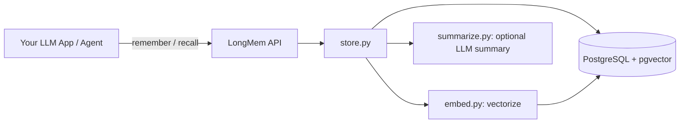
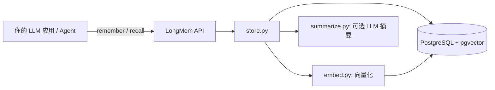

# LongMem


> Lightweight long-term memory middleware for LLM apps and agents.
> Store memories in your own PostgreSQL + pgvector — no closed-source service required.

轻量级 AI 长期记忆中间件 —— 给任意 LLM 应用 / Agent 加上「长期记忆」，数据存
在自己可控的 PostgreSQL + pgvector 里，不依赖任何闭源服务。

> 痛点：现在自建 chatbot / agent 的人一大堆，但「记忆」几乎都要自己造轮子。
> LongMem 把 remember / recall 两个接口做好，开箱即用、可插拔 embedding。

[English](#english) | 中文 | [Changelog](CHANGELOG.md)

---

## English

LongMem gives any LLM application or agent persistent, long-term memory. Memories
are stored in **your own PostgreSQL + pgvector** instance, so data never leaves
your infrastructure and you are not tied to any closed-source vendor.

### Why

Everybody building their own chatbot / agent needs memory, yet almost everyone
reinvents the wheel. LongMem ships the two operations that matter —
`remember` (write) and `recall` (retrieve by similarity) — and gets out of your way.

### Features

- **remember** — store a memory (optional LLM auto-summary for long text)
- **recall** — retrieve by cosine similarity via pgvector, isolated per `user_id` / `session_id`
- **manage** — list / delete one / forget a whole user
- **pluggable embedding** — local deterministic fallback works with zero dependencies
  (great for dev/tests); flip one config to an OpenAI-compatible endpoint
  (DeepSeek / self-hosted / OpenAI)
- **two entry points** — HTTP API (FastAPI, Swagger at `/docs`) or Python SDK

### Architecture

```
your app ──remember/recall──> LongMem ──> PostgreSQL + pgvector
                                  │
                                  ├─ embed.py   (vectorize)
                                  ├─ summarize  (optional summary)
                                  └─ store.py   (core logic)
```



### Quick start

```bash
# 1. Have PostgreSQL + pgvector ready (skip if you already do)
# 2. Install
python3 -m venv .venv && source .venv/bin/activate
pip install -e .            # or: pip install -r requirements.txt

# 3. Configure
cp .env.example .env        # edit PG connection, EMBED_PROVIDER, etc.

# 4. Create tables
python -c "from longmem import init_db; init_db()"

# 5. Run (default :8123, Swagger at /docs)
python -m longmem.api
```

### HTTP API

```bash
# write
curl -X POST localhost:8123/remember \
  -H 'Content-Type: application/json' \
  -d '{"user_id":"alice","content":"User prefers Python","mem_type":"preference"}'

# recall (optionally filter by type, or bias toward recent memories)
curl -X POST localhost:8123/recall \
  -H 'Content-Type: application/json' \
  -d '{"user_id":"alice","query":"what language does the user like","top_k":3,"type_filter":"preference","recency_bias":0.3}'

# list / update / delete / forget
curl "localhost:8123/memories?user_id=alice"
curl -X PUT localhost:8123/memory/1 -H 'Content-Type: application/json' \
  -d '{"content":"updated text","mem_type":"preference"}'
curl -X DELETE localhost:8123/memory/1
curl -X POST localhost:8123/forget -H 'Content-Type: application/json' -d '{"user_id":"alice"}'
```

### Python SDK

```python
from longmem import Memory

mem = Memory(user_id="alice", session_id="s1")
mem.remember("User is a backend engineer")
results = mem.recall("user's technical background")
print(results[0]["content"], results[0]["score"])
mem.update(results[0]["id"], content="User is a backend engineer, likes Go")
# recall only preferences, biased toward recent ones
recent_prefs = mem.recall("user preferences", type_filter="preference", recency_bias=0.3)

### CLI

```bash
longmem remember --user alice --content "likes Python" --type preference
longmem recall   --user alice --query "what language"
longmem list     --user alice
longmem delete   --id 1
longmem forget   --user alice
longmem purge    --once          # hard-delete all expired memories
longmem purge    --interval 60   # daemon: repeat every 60s
```

### Batch write & TTL

Write many memories in one request, and optionally give each a time-to-live:

```bash
# batch write
curl -X POST localhost:8123/remember/batch \
  -H 'Content-Type: application/json' \
  -d '{"items":[
        {"user_id":"alice","content":"likes Python","ttl_seconds":3600},
        {"user_id":"alice","content":"likes coffee"}
      ]}'

# a memory with ttl_seconds expires automatically — recall/list skip it,
# and POST /forget/expired (or /purge) hard-deletes all expired memories.
curl -X POST localhost:8123/forget/expired -H 'Content-Type: application/json' -d '{}'
curl -X POST localhost:8123/purge -H 'Content-Type: application/json' -d '{}'
```

```python
from longmem import Memory
mem = Memory(user_id="alice")
mem.remember("临时偏好", ttl_seconds=3600)          # expires in 1h
mem.remember_batch([{"content": "a"}, {"content": "b"}])
```

### Switch to a real embedding model

Edit `.env`:

```
EMBED_PROVIDER=openai
EMBED_BASE_URL=https://your-endpoint/v1
EMBED_API_KEY=sk-xxx
EMBED_MODEL=text-embedding-3-small
EMBED_DIM=1536          # MUST match the model's output dimension
```

> Note: the default fallback embedding is a deterministic bag-of-tokens vector
> (CJK char-level, latin word-level). It proves the full stack end-to-end with no
> API key, but is **not** semantically meaningful. Use a real model in production.

### Examples

- `examples/basic.py` — minimal SDK usage.
- `examples/web_demo.py` — zero-dependency web UI (see `examples/README.md`).

### Docker (one command)

```bash
docker compose up --build
# API at http://localhost:8123, Swagger at /docs
```

This spins up PostgreSQL + pgvector and the LongMem API together. Tables are
auto-created on boot. Override PG / embedding settings via environment in
`docker-compose.yml`.

### Tests

```bash
pip install -e ".[dev]"
pytest
```

### License

MIT — see [LICENSE](./LICENSE).

---

## 中文

### 架构



### 特性

- 写入记忆：`/remember`（长文本可选 LLM 自动摘要）
- 召回记忆：`/recall`（pgvector 余弦相似度，按 user / session 隔离）
- 记忆管理：列出 / 删除单条 / 清空某用户
- 可插拔 embedding：默认本地确定性 fallback（零依赖即可跑），一行配置切到
  OpenAI 兼容端点（DeepSeek / 自建模型均可）
- 两种接入方式：HTTP API（FastAPI，自带 Swagger）或 Python SDK

### 快速开始

```bash
python3 -m venv .venv && source .venv/bin/activate
pip install -e .            # 或 pip install -r requirements.txt
cp .env.example .env
python -c "from longmem import init_db; init_db()"
python -m longmem.api       # 默认 :8123，Swagger 在 /docs
```

### HTTP API

```bash
curl -X POST localhost:8123/remember -H 'Content-Type: application/json' \
  -d '{"user_id":"alice","content":"用户喜欢用 Python","mem_type":"preference"}'
curl -X POST localhost:8123/recall -H 'Content-Type: application/json' \
  -d '{"user_id":"alice","query":"用户用什么语言","top_k":3,"type_filter":"preference","recency_bias":0.3}'
curl "localhost:8123/memories?user_id=alice"
curl -X PUT localhost:8123/memory/1 -H 'Content-Type: application/json' \
  -d '{"content":"更新后的文本","mem_type":"preference"}'
curl -X DELETE localhost:8123/memory/1
curl -X POST localhost:8123/forget -H 'Content-Type: application/json' -d '{"user_id":"alice"}'
```

### Python SDK

```python
from longmem import Memory
mem = Memory(user_id="alice", session_id="s1")
mem.remember("用户是一名后端工程师")
results = mem.recall("用户的技术背景")
print(results[0]["content"], results[0]["score"])
mem.update(results[0]["id"], content="用户是后端工程师，喜欢 Go")
# 只召回偏好类，并偏向近期记忆
recent_prefs = mem.recall("用户偏好", type_filter="preference", recency_bias=0.3)
```

### CLI

```bash
longmem remember --user alice --content "喜欢 Python" --type preference
longmem recall   --user alice --query "用什么语言"
longmem list     --user alice
longmem delete   --id 1
longmem forget   --user alice
longmem purge    --once          # hard-delete all expired memories
longmem purge    --interval 60   # daemon: repeat every 60s
```

### 批量写入与 TTL（过期）

一次写多条记忆，并可给每条设置存活时间（秒）：

```bash
# 批量写入
curl -X POST localhost:8123/remember/batch \
  -H 'Content-Type: application/json' \
  -d '{"items":[
        {"user_id":"alice","content":"喜欢 Python","ttl_seconds":3600},
        {"user_id":"alice","content":"喜欢咖啡"}
      ]}'

# 带 ttl_seconds 的记忆会自动过期：recall/list 会跳过它；
# POST /forget/expired（或 /purge）则把已过期记忆物理删除。
curl -X POST localhost:8123/forget/expired -H 'Content-Type: application/json' -d '{}'
curl -X POST localhost:8123/purge -H 'Content-Type: application/json' -d '{}'
```

```python
from longmem import Memory
mem = Memory(user_id="alice")
mem.remember("临时偏好", ttl_seconds=3600)          # 1 小时后过期
mem.remember_batch([{"content": "a"}, {"content": "b"}])
```

### 切换到真实 Embedding 模型

编辑 `.env`：

```
EMBED_PROVIDER=openai
EMBED_BASE_URL=https://你的端点/v1
EMBED_API_KEY=sk-xxx
EMBED_MODEL=text-embedding-3-small
EMBED_DIM=1536          # 必须与模型输出维度一致
```

> 注意：默认 fallback embedding 是确定性的词袋向量（中文逐字、拉丁逐词），
> 仅用于零依赖跑通全链路验证，**不具备语义意义**，生产请使用真实模型。

### 示例

- `examples/basic.py` — 最小 SDK 用法。
- `examples/web_demo.py` — 零依赖网页界面(见 `examples/README.md`)。

### Docker（一条命令）

```bash
docker compose up --build
# API 在 http://localhost:8123，Swagger 在 /docs
```

一键起 PostgreSQL + pgvector 与 LongMem API，建表自动完成。可在
`docker-compose.yml` 中用环境变量覆盖 PG / embedding 配置。

### 测试

```bash
pip install -e ".[dev]"
pytest
```

### License

MIT
